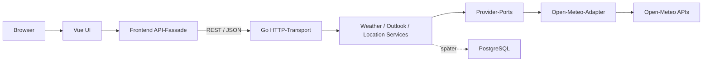
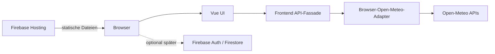

# ISOBAR

**Daten statt Drama.**

ISOBAR ist eine sachliche Wetteranwendung für aktuelle Messwerte,
Modellvergleiche und langfristige Wettertrends. Die Anwendung zeigt
Unsicherheit bewusst sichtbar und verzichtet auf Werbung, Clickbait und
dramatisierende Schlagzeilen.

- Live auf Firebase: <https://isobar-7d8eb.web.app>
- Lokal mit Docker: <http://localhost:8090>
- Architektur und Lernpfad: [ISOBAR verstehen](docs/ARCHITECTURE.md)
- Verifikation und Skill-Gewichte: [Methodik und Grenzen](docs/VERIFICATION.md)
- Regelbasierte Erklärungen: [Forecast Interpretation Engine](docs/INTERPRETATION_ENGINE.md)
- Oberfläche und Graphen: [UI-, Labor- und Graphmodule](docs/UI_AND_GRAPH_MODULES.md)
- Daten und Geocoding: [Open-Meteo](https://open-meteo.com/)

## Status

Die erste eigenständig nutzbare Wetterversion ist fertig und online. Sie
enthält noch keine Benutzerkonten, gespeicherten Orte, News oder Feeds. Die
Architektur ist so vorbereitet, dass diese Funktionen später als eigene
Module ergänzt werden können.

## Was die App kann

### Aktuelles Wetter

- Ortssuche nach Name oder Postleitzahl
- Temperatur und gefühlte Temperatur
- Luftfeuchtigkeit und Luftdruck
- Niederschlag
- Windgeschwindigkeit, Böen und Windrichtung
- Sonnenaufgang und Sonnenuntergang
- Aktualisierungszeit und verwendete Zeitzone

### 36-Stunden-Modellvergleich

ISOBAR lädt die Modelle DWD ICON, ECMWF IFS und NOAA GFS und stellt sie als
getrennte interaktive Kurven dar.

Umschaltbare Größen:

- Temperatur
- Niederschlagswahrscheinlichkeit
- Windgeschwindigkeit

Der Chart beginnt in der Nähe des aktuellen Modellzeitpunkts und zeigt die
folgenden 36 Stunden. Über Maus oder Touch kann ein Zeitpunkt untersucht
werden.

### Modellkonsens

ISOBAR macht aus mehreren Modellen keine vermeintlich perfekte Vorhersage.
Stattdessen werden robuste Zusammenfassungen berechnet:

- Median der erwarteten Tageshöchsttemperatur
- Median der erwarteten Tagestiefsttemperatur
- Spannweite zwischen niedrigstem und höchstem Modell
- Median der Niederschlagswahrscheinlichkeit der ersten sechs Stunden
- Übereinstimmung der Modelle

Die Übereinstimmung basiert aktuell auf der Spanne der Tageshöchsttemperatur:

| Modellspanne | Bewertung |
| --- | --- |
| bis 2 K | hoch |
| über 2 bis 4 K | mittel |
| über 4 K | niedrig |

### 10-Tage-Ausblick

Für jeden Tag werden die verfügbaren Modelle zusammengeführt:

- Median für Höchst- und Tiefsttemperatur
- Median für Niederschlag, Regenwahrscheinlichkeit, Wind und Böen
- häufigster Wettercode

Das Ergebnis ist bewusst als Modellmedian beschriftet und nicht als sichere
Messung.

### 16-Tage-Langfrist-Labor

Der 16-Tage-Modus vergleicht:

- DWD ICON
- ECMWF IFS
- ECMWF AIFS
- NOAA GFS

Die Modelle enden an ihrer jeweils nativen Reichweite. Eine Linie wird nicht
künstlich bis Tag 16 verlängert. Zusätzlich zeigt ISOBAR:

- Modellmedian
- vollständige Modellspanne als Band
- Tageshoch
- Tagestief
- Niederschlag
- tatsächliche Anzahl verfügbarer Tage pro Modell

### 30-Tage-Ensembles

Der 30-Tage-Modus lädt mehrere Ensemble-Suites mit unterschiedlichen nativen
Reichweiten. Die einzelnen Modelle bleiben mit ihren jeweiligen P10-, P50- und
P90-Werten untersuchbar; der vollständige Modellsatz und die Rolle von EC46
stehen im folgenden Abschnitt.

Für jeden verfügbaren Modelltag berechnet ISOBAR:

- P10
- Median beziehungsweise P50
- P90

Das Band zwischen P10 und P90 ist ein Wahrscheinlichkeitsraum. Es ist keine
garantierte Tagesprognose. Die Ensembleansicht wird erst geladen, wenn sie
angeklickt wird.

### ISOBAR Fusion – Phase 1

Die Ensembleansicht enthält zusätzlich eine eigene empirische Tagesfusion.
Sie verbindet mehrere Ensemblemodelle, ohne sie zu einem scheinbar sicheren
Einzelwert zu glätten:

| Modell | Native Orientierung | Rolle in Phase 1 |
| --- | --- | --- |
| DWD ICON-EU EPS | regional, ungefähr bis Tag 5 | Kurzfristfusion |
| ECMWF IFS ENS | global, ungefähr bis Tag 15 | Mittelbereichsfusion |
| ECMWF AIFS ENS | KI-basiert, ungefähr bis Tag 15 | Mittelbereichsfusion |
| Google WeatherNext 2 | KI-basiert, ungefähr bis Tag 15 | Mittelbereichsfusion |
| NOAA GEFS 0.5° | global, bis ungefähr Tag 35 | Fusion, in der aktuellen Ansicht maximal 30 Tage |
| ECMWF EC46 | erweiterte Orientierung bis ungefähr Tag 46 | separate Langfristansicht, nicht Teil der Tagesfusion |

Die Reichweiten sind keine künstlich aufgefüllten Garantien. Sie richten sich
nach den tatsächlich gelieferten Daten und können sich beim Provider ändern.
Deshalb sinken Modell- und Mitgliederzahl mit wachsendem Horizont: Endet ein
Modell oder fehlen Werte, wird es für den betreffenden Tag nicht mitgezählt.

Die Methode heißt `equal-model-weighted-empirical`. Pro Tag erhält jedes
verfügbare Fusionsmodell dasselbe Gesamtgewicht; seine Mitglieder teilen sich
dieses Gewicht gleichmäßig. Ein Modell gewinnt dadurch nicht allein deshalb
mehr Einfluss, weil es mehr Ensemblemitglieder liefert.

Phase 1 berechnet:

- Temperatur: P10, P25, P50, P75 und P90
- Niederschlagsmenge: P10, P50 und P90
- rohe tägliche Ensemblewahrscheinlichkeit für mindestens 1 mm Niederschlag
- rohe tägliche Ensemblewahrscheinlichkeit für mindestens 10 mm Niederschlag
- tatsächlich beteiligte Modell- und Mitgliederzahl je Tag

„Roh“ ist dabei wichtig: Die Wahrscheinlichkeiten sind gewichtete empirische
Anteile der aktuell verfügbaren Läufe. Sie sind noch nicht anhand historischer
Beobachtungen kalibriert. Phase 1 kennt weder lokale Modellgüte noch saisonale
Fehlerkorrekturen oder Skill-Gewichte. Run-to-run-Stabilität und historische
Trefferquoten werden ebenfalls noch nicht berechnet.

Die Modellaufrufe werden gecacht: im Go-Modus 30 Minuten im Arbeitsspeicher,
im Firebase-Modus 30 Minuten pro Browser-Tab im `sessionStorage`. Einzelne
Providerfehler werden als Warnung ausgewiesen; die Fusion verwendet dann nur
die für den jeweiligen Tag erfolgreich verfügbaren Modelle. Sind gar keine
verwertbaren Ensembledaten vorhanden, wird keine Fusion ausgegeben. Im
Go-Modus kann bei einem vollständigen Aktualisierungsfehler zusätzlich der
letzte abgelaufene Cache-Stand als `stale` zurückgegeben werden.

### ISOBAR Fusion – Evidence-Stufe

Für zentral überwachte Orte ergänzt der GitHub-Actions-Collector die Rohfusion:

- DWD-CDC-Stationsmessungen als bevorzugte Referenz;
- DWD MOSMIX als separaten Punkt-Challenger;
- einen historischen Klimakalender für jeden Monatstag;
- lokale Bias- und Fehlerabhängigkeitsparameter im Shadow-Modus;
- einen erklärbaren Fragility Index;
- ein gepaartes Out-of-Sample-Gate mit mindestens 30 unabhängigen Zukunftstagen.

Der Shadow-Challenger verändert die Live-Prognose nicht. Auch ein positives Gate löst keine automatische Promotion aus. Methodik und Grenzen stehen in der [Evidence-Engine-Dokumentation](docs/EVIDENCE_ENGINE.md).

### Forecast Interpretation Engine

Das Wetterbriefing führt die vorhandenen Daten für genau einen Gültigkeitstag zusammen. Sechs getrennte Module erklären Wetterlage, Modellstreuung, Szenarien, historischen Klimakontext, Verifikationsstand und Datenqualität. Die Oberfläche bietet einen bewusst einfachen Überblick, freiwilligen Kontext und eine getrennte Methodikansicht mit Originalwerten und Quellpfaden. Fehlende Zusatzmodule erzeugen im Überblick keine leeren Karten.

Die Texte sind deterministisch und regelbasiert. Die Engine erzeugt keine neue Prognose, verändert keine Rohdaten und verwendet kein Sprachmodell. Fehlende Bereiche werden als teilweise oder nicht verfügbar ausgewiesen. Forecast Interpreter, Evidence Engine, Scenario Engine und Climate Time Machine teilen sich dieselbe Datumsauswahl.

Architektur, Schwellenwerte, Testinvarianten und Erweiterungsworkflow stehen in der [Dokumentation der Interpretation Engine](docs/INTERPRETATION_ENGINE.md).

### Interaktion und Barrierearmut

- Maus- und Touch-Navigation
- Navigation per linker und rechter Pfeiltaste
- auswählbare und hervorhebbare Modellreihen
- Tageswerte und Unsicherheitsbereiche im Readout
- responsive Darstellung auf kleinen Bildschirmen

### Palette Engine

Das Design verwendet kein Vuetify und kein fertiges Dashboard-Theme. Es ist
mit Vue-Komponenten, SVG und CSS-Variablen eigenständig umgesetzt.

Enthaltene Paletten:

1. Carbon Lime
2. Mint Dusk
3. Polar Night
4. Amber Archive
5. Violet Pressure
6. Signal Red

Im Automatikmodus wird pro Besuch eine andere kuratierte Palette ausgewählt.
Die Automatik kann ausgeschaltet und die Palette manuell gewechselt werden.
Die Einstellung liegt ausschließlich im `localStorage` des Browsers.

## Das duale System

ISOBAR besitzt **eine Vue-Anwendung**, aber zwei austauschbare Wege zu den
Wetterdaten.

| Modus | Frontend erhält Wetterdaten von | Geeignet für |
| --- | --- | --- |
| Server | Go-REST-API | Docker, eigener Server, spätere zentrale Datenbank |
| Firebase | Open-Meteo direkt im Browser | kostenloses statisches Spark Hosting |

Das Frontend importiert in beiden Fällen dieselben Funktionen:

```ts
getForecast(...)
searchLocations(...)
getOutlook(...)
```

Die API-Fassade entscheidet beim Build, welcher Adapter dahinterliegt. Deshalb
müssen Komponenten wie `WeatherChart` oder `LongRangeLab` nichts über Docker,
Go oder Firebase wissen.

### Server-Modus



Der Server-Modus wird vom normalen Vite-Build und von Docker verwendet. Nginx
liefert das Frontend aus und leitet `/api/*` an den Go-Container weiter.

### Firebase-Spark-Modus



Firebase führt in diesem Modus **keinen Wetterserver** aus. Firebase Hosting
liefert HTML, CSS und JavaScript. Danach ruft der Browser Open-Meteo direkt
auf. Das funktioniert, weil Open-Meteo Browserzugriffe per CORS erlaubt.

Firestore ist als öffentlich lesbarer, nur vom Admin-Collector beschreibbarer Forecast-Speicher aktiv. Auth wird weiterhin nicht benötigt. Firebase Analytics ist standardmäßig deaktiviert.

## Warum beide Wege sinnvoll sind

Der Firebase-Modus bringt die App ohne Serverkosten online. Der Go-Modus bleibt
wertvoll, sobald eine dieser Anforderungen entsteht:

- zentrale Prognosehistorie
- serverweiter Cache
- eigene Open-Meteo-Zugangsdaten
- Benutzerkonten mit eigener Geschäftslogik
- gespeicherte Orte oder Benachrichtigungen
- amtliche Warnungen aus mehreren Providern
- Rate Limiting und Missbrauchsschutz
- eigene Datenanalyse
- kommerzieller Betrieb

Ich habe deshalb nicht zwei Oberflächen gebaut. Wir haben zwei Adapter hinter
demselben Frontend-Vertrag gebaut.

## Architektur des Go-Backends

Das Backend folgt einer pragmatischen Clean Architecture.

### Domain

`backend/internal/weather` und `backend/internal/location`

Enthalten:

- fachliche Datentypen
- Provider-Interfaces beziehungsweise Ports
- Konsens- und Quantil-Logik
- Services
- Cache-Verhalten

Die Domain kennt weder HTTP noch konkrete Open-Meteo-URLs.

### Adapter

`backend/internal/adapters/openmeteo`

Der Adapter:

- baut Open-Meteo-Anfragen
- normalisiert Antworten
- toleriert teilweise ausfallende Modelle
- berechnet Ensemble-Quantile
- implementiert die Provider-Interfaces der Domain

Ein anderer Wetteranbieter kann später als weiterer Adapter ergänzt werden.

### Transport

`backend/internal/transport/httpapi`

Der HTTP-Transport:

- validiert Query-Parameter
- setzt Zeitlimits
- übersetzt Fehler in JSON-Antworten
- setzt CORS- und Sicherheitsheader
- protokolliert Requests

### Composition Root

`backend/cmd/api/main.go`

Hier werden konkrete Adapter und Services zusammengesteckt. Nur dieser
äußerste Bereich weiß, welche Implementierung tatsächlich verwendet wird.

## Datenfluss und Caches

### Server-Modus

- Kurzfristprognose: 10 Minuten In-Memory-Cache
- Langfristprognose: 30 Minuten In-Memory-Cache
- Bei einem Provider-Ausfall können abgelaufene Serverdaten als `stale`
  zurückgegeben werden.
- Ein Neustart des Backend-Containers leert den Cache.

### Firebase-Modus

- Kurzfristprognose: 10 Minuten `sessionStorage`
- Langfristprognose: 30 Minuten `sessionStorage`
- Der Cache gilt nur für den jeweiligen Browser-Tab.
- Für konfigurierte Orte liegen zentrale, versionierte Läufe in Firestore.
- Nicht überwachte Orte verwenden weiterhin nur den lokalen Browser-Cache.
- Die großen 16- und 30-Tage-Datensätze werden erst auf Benutzeraktion geladen.

## Projektstruktur

```text
WeatherApp/
├─ backend/
│  ├─ cmd/api/                         Startpunkt des Go-Servers
│  └─ internal/
│     ├─ weather/                      Domain und Geschäftslogik
│     ├─ location/                     Ortssuche-Domain
│     ├─ adapters/openmeteo/           externer Wetteradapter
│     └─ transport/httpapi/            REST-Transport
├─ frontend/
│  ├─ src/
│  │  ├─ api/                          stabile API-Fassade
│  │  ├─ adapters/browser-weather/     Spark-/Browseradapter
│  │  ├─ components/                   Vue-Oberfläche und Charts
│  │  ├─ composables/                  Palette Engine
│  │  ├─ lib/interpretation/           modulare Forecast-Erklärungen
│  │  ├─ lib/                          Firebase und Formatierung
│  │  └─ types/                        gemeinsame TypeScript-Verträge
│  ├─ .env.firebase                    Firebase-Buildmodus
│  ├─ Dockerfile
│  └─ nginx.conf
├─ firebase/
│  └─ README.md                        Hinweise zur Spark-Variante
├─ compose.yaml                        lokaler Standalone-Stack
├─ firebase.json                       Hosting-Build und SPA-Routing
└─ .firebaserc                         Firebase-Projektzuordnung
```

## Technologie

### Frontend

- Vue 3
- TypeScript
- Vite
- native SVG-Charts
- CSS Custom Properties
- Firebase Web SDK

### Backend

- Go
- Standardbibliothek für HTTP und JSON
- explizite Interfaces statt Framework-Magie

### Infrastruktur

- Docker Compose
- Nginx
- PostgreSQL 17
- Firebase Hosting

## Lokal mit Docker starten

Voraussetzungen:

- Docker Desktop
- freier Port 8090 oder ein eigener `ISOBAR_PORT`

```powershell
Copy-Item .env.example .env
docker compose up -d --build
```

Danach:

- Anwendung: <http://localhost:8090>
- interne Go-API: Port 8081 im Compose-Netz
- PostgreSQL: Port 5432 im Compose-Netz

Status prüfen:

```powershell
docker compose ps
```

Stoppen:

```powershell
docker compose down
```

Das Volume `isobar-data` bleibt dabei erhalten.

## Lokal ohne Docker entwickeln

Backend:

```powershell
cd backend
go run ./cmd/api
```

Frontend in einem zweiten Terminal:

```powershell
cd frontend
npm install
npm run dev
```

Vite läuft auf <http://localhost:5173> und leitet `/api` an
<http://localhost:8081> weiter.

## Builds

### Build für Go-REST oder Docker

```powershell
npm --prefix frontend run build
```

Ohne `VITE_WEATHER_SOURCE=direct` verwendet das Frontend die relative
REST-API unter `/api/v1`.

### Build für Firebase Spark

```powershell
npm --prefix frontend run build:firebase
```

Dieser Build lädt `frontend/.env.firebase` und setzt:

```env
VITE_WEATHER_SOURCE=direct
VITE_FIREBASE_ANALYTICS_ENABLED=false
```

## Firebase deployen

Das Projekt ist mit `isobar-7d8eb` verbunden.

```powershell
npx firebase-tools deploy --only hosting
```

Firebase führt vor dem Upload automatisch `build:firebase` aus. Veröffentlicht
wird ausschließlich `frontend/dist`. Das SPA-Rewrite liefert bei unbekannten
Routen wieder `index.html`; Dateien unter `/assets` erhalten einen langfristigen
Immutable-Cache.

Live-URL:

<https://isobar-7d8eb.web.app>

Es werden keine Functions und kein Cloud Run deployt.

## Umgebungsvariablen

| Variable | Standard | Bedeutung |
| --- | --- | --- |
| `ISOBAR_PORT` | `8090` | öffentlicher lokaler Docker-Port |
| `POSTGRES_USER` | `isobar` | lokaler Datenbankbenutzer |
| `POSTGRES_PASSWORD` | `isobar-local` | lokales Datenbankpasswort |
| `POSTGRES_DB` | `isobar` | lokale Datenbank |
| `VITE_WEATHER_SOURCE` | `server` | `server` oder `direct` |
| `VITE_FIREBASE_ANALYTICS_ENABLED` | `false` | Analytics-Buildschalter |

Die Firebase-Webkonfiguration ist zwar öffentlich vorgesehen, wird aber zur
sauberen Umgebungstrennung nicht im Repository gespeichert. Lokal liegt sie in
`frontend/.env.firebase.local`; die Vorlage steht in `frontend/.env.example`.
Sicherheit für spätere Daten entsteht zusätzlich durch Auth, Security Rules und
App Check.

## REST API

Die REST-Endpunkte existieren nur im Go-/Server-Modus.

```text
GET /api/v1/health
GET /api/v1/locations?q=Köln
GET /api/v1/weather?lat=50.9991&lon=7.0387&name=Köln
GET /api/v1/weather/outlook?view=16&lat=50.9991&lon=7.0387
GET /api/v1/weather/outlook?view=30&lat=50.9991&lon=7.0387
```

Fehler werden einheitlich ausgeliefert:

```json
{
  "error": {
    "code": "weather_unavailable",
    "message": "Die Wetterdaten sind momentan nicht erreichbar."
  }
}
```

## PostgreSQL

PostgreSQL läuft bereits als eigener, persistenter Compose-Service. Die
Wetterversion schreibt noch keine Daten in die Datenbank.

Das ist Absicht: Eine Datenbank wird erst verwendet, wenn fachlich persistente
Daten existieren, beispielsweise:

- gespeicherte Orte
- Benutzerprofile
- Prognose-Snapshots
- Favoriten
- Benachrichtigungseinstellungen

So vermeiden wir leere Repository-Schichten und unnötige Tabellen.

### Wissenschaftliche Roadmap

Die serverlose Forschungsstufe speichert versionierte Prognose-Snapshots und Run-to-run-Verschiebungen in Firestore. Nach Tagesende bevorzugt der Collector DWD-Stationsmessungen und nutzt nur bei Datenlücken den klar markierten Analysis-Proxy. Er berechnet MAE, CRPS und Brier Scores getrennt nach Vorhersagehorizont.

Ab 14 verschiedenen Verifikationstagen dürfen konservativ geschrumpfte, begrenzte Skill-Gewichte aktiv werden. Ein separater Evidence-Shadow untersucht lokalen Temperatur-Bias, Fehlerabhängigkeit und Intervall-Coverage, verändert den Live-Champion aber nicht.

Das Out-of-Sample-Gate benötigt mindestens 30 unabhängige Zukunftstage und eine positive untere 95-%-Grenze der gepaarten CRPS-Verbesserung. Bis diese reale Zeit verstrichen ist, bleibt die Baseline aktiv. RADOLAN, Reliability-Bins und der Kalibrierungs-Challenger sind technisch vorbereitet; offen bleiben vor allem genügend Zukunftsevidenz, vollständige Regenkalibrierung, saisonale Auswertung und Drift-Erkennung. Details stehen in der [Evidence-Engine-Dokumentation](docs/EVIDENCE_ENGINE.md).

## Firebase Spark: Möglichkeiten und Grenzen

Auf dem Spark-Plan können wir innerhalb der kostenlosen Kontingente später
ergänzen:

- Firebase Authentication
- Cloud Firestore
- Remote Config
- App Check
- Cloud Messaging

Nicht als kostenloser Serverersatz verfügbar:

- neue Cloud-Functions-Deployments
- Cloud Run
- beliebige serverseitige Go-Ausführung

Offizielle Informationen:

- [Firebase-Pläne](https://firebase.google.com/docs/projects/billing/firebase-pricing-plans)
- [Hosting-Kontingente](https://firebase.google.com/docs/hosting/usage-quotas-pricing)
- [Firestore-Kontingente](https://firebase.google.com/docs/firestore/quotas)

## Datenschutz

- keine Benutzerkonten
- keine eigenen Tracking-Cookies
- keine Werbung
- keine serverseitigen Nutzerprofile
- Palette nur im `localStorage`
- Wettercache nur im `sessionStorage` der Firebase-Variante
- Firebase Analytics standardmäßig deaktiviert

Bevor Analytics aktiviert wird, braucht die Anwendung eine bewusste
Einwilligungs- und Datenschutzentscheidung.

## Wetterdaten und Nutzung

Open-Meteo verlangt eine Quellenangabe. Die App nennt Open-Meteo im Footer.

Die kostenlose Open-Meteo-API ist für nichtkommerzielle Nutzung vorgesehen und
aktuell auf weniger als 10.000 API-Aufrufe pro Tag, 5.000 pro Stunde und 600 pro
Minute begrenzt. Lange Zeiträume und Anfragen mit mehreren Modellen oder
Variablen können anteilig als mehrere API-Aufrufe gezählt werden. Für
kommerziellen Betrieb oder größere Reichweite muss der Providervertrag geprüft
und gegebenenfalls ein Kunden-Endpunkt verwendet werden.

Die Fusion ruft mehrere Modelle beziehungsweise Endpunkte ab und verbraucht
damit mehr API-Kontingent als eine einzelne Vorhersage. Lazy Loading, die oben
beschriebenen Caches und das Weiterarbeiten mit Teilergebnissen begrenzen diese
Last, heben die kostenlosen Limits aber nicht auf. Die Quellenangabe für
Open-Meteo bleibt auch für die fusionierten Werte verpflichtend; ISOBAR zeigt
sie im Footer.

- [Open-Meteo-Dokumentation](https://open-meteo.com/en/docs)
- [Open-Meteo-Preise und Limits](https://open-meteo.com/en/pricing)

## Qualitätssicherung

Backend:

```powershell
cd backend
go test ./...
```

Frontend und TypeScript:

```powershell
cd frontend
npm run test
npm run lint
npm run build
npm run build:firebase
npm audit
```

Live-Prüfung:

```powershell
Invoke-WebRequest https://isobar-7d8eb.web.app
```

## Bekannte Grenzen

- Das aktuelle Design ist eine Wetter-App, noch keine PWA.
- Es gibt noch keine amtlichen Unwetterwarnungen.
- Die zentrale Prognosehistorie wird aktuell nur für konfigurierte Orte aufgebaut.
- DWD-Stationen sind punktuell; fehlende Messtage nutzen einen markierten Analysis-Proxy.
- Open-Meteo ist im kostenlosen Modus ohne Verfügbarkeitsgarantie.
- Modellreichweiten unterscheiden sich und können sich providerseitig ändern.
- PostgreSQL ist vorbereitet, aber fachlich noch nicht angeschlossen.

## Erweiterungsstrategie

Neue Funktionen sollen als klar abgegrenzte Module entstehen.

Beispiele:

1. `alerts` für amtliche Warnungen
2. `favorites` für gespeicherte Orte
3. `history` für Prognose-Snapshots
4. `accounts` für Benutzerkonten
5. `notifications` für konfigurierbare Hinweise

Für jedes Modul gilt:

- eigene Domain-Typen
- eigene Geschäftsregeln
- eigener Provider- oder Repository-Port
- eigener Adapter
- schmale REST-Schnittstelle
- UI-Komponenten, die nur den Frontend-Vertrag kennen

## Produktleitlinien

- Messung und Prognose werden nicht vermischt.
- Unsicherheit wird gezeigt und nicht versteckt.
- Modellunterschiede werden erklärt.
- Langfristprognosen werden nicht als Gewissheit dargestellt.
- Warnungen kommen später nur aus amtlichen Quellen.
- Keine Werbung, keine Panik, keine künstliche Dringlichkeit.
- Neue Bereiche werden modular ergänzt.


## Research Pipeline v1

Scenario Engine, exakte Unsicherheitszerlegung, Multi-run Memory, Forecast Passport, RADOLAN, historischer Shadow-Backfill, probabilistische Diagnostik und der inaktive Kalibrierungs-Challenger sind in [docs/RESEARCH_PIPELINE.md](docs/RESEARCH_PIPELINE.md) dokumentiert.

Wichtig: Diese Funktionen erweitern die sichtbare Evidenz sofort. Hoehere Prognoseguete darf weiterhin erst nach unabhaengiger Zukunftsverifikation behauptet werden.
