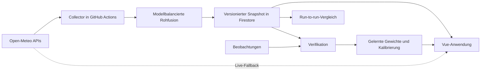

# ISOBAR verstehen

ISOBAR ist keine weitere Wetterseite, die eine einzelne Zahl als Gewissheit verkauft. Die Anwendung zeigt mehrere numerische Wettermodelle, ihre Streuung und die Grenzen der Aussage. Das langfristige Ziel ist eine überprüfbare, lokal kalibrierte Prognose statt einer dramatisierten Schlagzeile.

## Das System in einem Bild



Firebase ist dabei Speicher und Hosting, nicht der Meteorologe. Die Berechnung läuft im zeitgesteuerten GitHub-Runner. Die Vue-Anwendung liest einen aktuellen gespeicherten Lauf und kann bei fehlenden Daten weiterhin direkt auf Open-Meteo zurückfallen.

## Die wichtigsten Begriffe

### Modelllauf

Ein Modell wird mehrmals täglich mit einem neuen Anfangszustand berechnet. Zwei Vorhersagen für denselben Dienstag können deshalb unterschiedlich sein. Wir speichern sowohl den Zeitpunkt des Modelllaufs als auch den Tag, für den die Vorhersage gilt.

### Ensemblemitglied

Ein Ensemblemodell startet viele leicht veränderte Simulationen. Die Mitglieder sind keine Abstimmungen von Menschen, sondern plausible Entwicklungen aus leicht unterschiedlichen Startbedingungen oder Modellannahmen.

### P10, P50 und P90

P50 ist der Median. P10 bis P90 beschreiben einen Bereich, in dem 80 Prozent der modellierten Verteilung liegen. Das ist keine garantierte Trefferwahrscheinlichkeit, solange die Verteilung noch nicht historisch kalibriert wurde.

### Modellbalancierte Fusion

Ein Modell mit 50 Mitgliedern soll nicht automatisch 50-mal wichtiger sein als ein Modell mit einem Mitglied. ISOBAR gibt jedem verfügbaren Modell pro Prognosetag zunächst dasselbe Gesamtgewicht. Erst innerhalb eines Modells teilen sich dessen Mitglieder dieses Gewicht.

### Run-to-run-Stabilität

Wir vergleichen zwei nacheinander gespeicherte Läufe für dieselben Gültigkeitstage. Gemessen werden die Verschiebung des Temperaturmedians, die Änderung des P10-P90-Korridors und die Änderung des Regensignals. Das beschreibt Stabilität, aber noch nicht Genauigkeit.

### Verifikation und Kalibrierung

Genauigkeit lässt sich erst nach dem Wetterereignis beurteilen. Dazu vergleichen wir alte Vorhersagen mit Beobachtungen. MAE misst Temperaturfehler, der Brier Score Ereigniswahrscheinlichkeiten und CRPS die Qualität einer vollständigen Wahrscheinlichkeitsverteilung. Erst mit ausreichend Historie dürfen daraus Modellgewichte oder eine EMOS-Kalibrierung gelernt werden.

## Warum die Codebase getrennt ist

Der Collector besteht aus kleinen Schichten:

- `openmeteo.mjs` kennt externe API-Formate.
- `fusion.mjs` enthält nur Statistik und keine Datenbanklogik.
- `stability.mjs` vergleicht aufeinanderfolgende Läufe.
- `snapshot.mjs` versioniert und hasht Datensätze.
- `firestore.mjs` speichert Daten, verändert aber keine Meteorologie.
- `cli.mjs` verbindet die Bausteine für den zeitgesteuerten Job.

Damit kann Firestore später durch PostgreSQL ersetzt werden, ohne die Formeln oder die Oberfläche neu zu schreiben. Umgekehrt können neue Modelle ergänzt werden, ohne die Persistenz umzubauen.

## Firestore-Datenmodell

```text
publicWeather/{locationId}
  latestRunId
  latestOutlook
  coordinates and metadata

publicWeather/{locationId}/runs/{runId}
  schemaVersion
  algorithmVersion
  capturedAt
  payloadHash
  outlook and run-to-run metrics

publicWeather/{locationId}/runs/{runId}/models/{modelId}
  raw ensemble distributions by validity date
```

Ein Payload-Hash macht Wiederholungen desselben Laufs idempotent. Schema- und Algorithmusversion verhindern, dass später Ergebnisse verschiedener Rechenmethoden unbemerkt vermischt werden.

## Aktueller Stand

Bereits umgesetzt:

- fünf gleich gewichtete Kurz- und Mittelfrist-Ensembles;
- EC46 als getrennte Langfrist-Referenz;
- P10/P25/P50/P75/P90 für Temperatur;
- P10/P50/P90 und rohe Ereignissignale für Niederschlag;
- schreibfreier Live-Collector-Test gegen alle sechs Modellquellen;
- Firestore-Snapshots mit gesperrten Browser-Schreibrechten;
- GitHub-Actions-Zeitplan alle sechs Stunden;
- Run-to-run-Metriken und Vue-Anzeige;
- DWD-CDC-Stationsmessungen als bevorzugte Referenz mit markiertem Analysis-Proxy-Fallback;
- DWD MOSMIX als separater, stationsoptimierter Challenger;
- Klimakalender 1991–2020 plus verfügbare Stationshistorie;
- Evidence-Shadow, Fragility Index und gepaartes Out-of-Sample-Gate;
- idempotente MAE-, CRPS- und Brier-Verifikation nach Vorhersagehorizont;
- konservative Skill-Gewichte ab 14 verschiedenen Verifikationstagen;
- sichtbarer Lern- und Aktivstatus im 30-Tage-Labor;
- direkter Browser-Fallback für noch nicht überwachte Standorte.

Noch nicht als fertige Wissenschaft behauptet:

- Skill-Gewichtung und Fragility sind keine vollständige Wahrscheinlichkeitskalibrierung;
- das Out-of-Sample-Gate braucht reale zukünftige Beobachtungstage;
- RADOLAN, Reliability-Diagramme, EMOS und Drift-Erkennung sind noch offen;
- es gibt noch keine belastbare Aussage, dass ISOBAR genauer als ein Einzelmodell ist.

Methodik und Schutzregeln stehen in [Forecast-Verifikation und Skill-Gewichte](VERIFICATION.md).

## Sinnvolle Ausbaustufen

1. Weitere feste Standorte sammeln und Datenlücken überwachen.
2. RADOLAN als flächige Niederschlagsreferenz ergänzen.
3. Gütemaße nach Ort, Saison und Wetterlage aufteilen.
4. Reliability-Diagramme und probabilistische Regenkalibrierung ergänzen.
5. Das Shadow-Gate über reale Zukunftstage beobachten und nur echte Verbesserungen reviewen.
6. Erst danach EMOS oder Quantile Mapping als neuen versionierten Challenger testen.
7. Später optionale Favoriten, Benachrichtigungen und Nutzerkonten hinzufügen.

Die fachlich wichtigste Regel bleibt: Ein komplizierter Algorithmus ist nicht automatisch ein besserer Algorithmus. Jede neue Methode muss gegen eine einfache, eingefrorene Baseline gewinnen.
