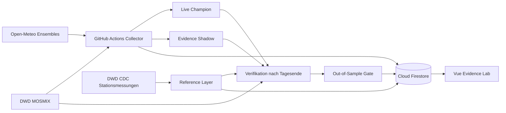

# Evidence Engine, DWD-Referenz und Klimakalender

Diese Ausbaustufe soll nicht nur mehr Wetterdaten zeigen. Sie schafft eine reproduzierbare Prüfung, ob eine lokale ISOBAR-Methode zukünftige Prognosen tatsächlich verbessert.

## Datenfluss



Firebase ist Speicher und Hosting. Die zeitgesteuerte Berechnung läuft im kostenlosen GitHub-Actions-Runner. Der Browser darf die veröffentlichten Dokumente lesen, aber nicht verändern.

## 1. DWD Reference Layer

Für jeden zentral überwachten Ort wählt die Konfiguration eine DWD-Klimastation. Köln verwendet aktuell:

- DWD Climate Data Center Station `02667` Köln/Bonn;
- Stationshöhe 91 m, ungefähr 15 km vom App-Referenzpunkt;
- Tagesmittel, Tagesminimum, Tagesmaximum, Niederschlag und Sonnenscheindauer;
- Qualitätsstufe und Status `final` oder `provisional` bleiben erhalten.

Die Stationsmessung ist die bevorzugte Referenz. Fehlt ein abgeschlossener Tag, fällt die Pipeline transparent auf den vorhandenen Open-Meteo-`analysis-proxy` zurück. Ein Proxy wird nie als Messung beschriftet.

## 2. Climate Time Machine

Beim ersten Lauf und danach ungefähr monatlich lädt der Collector das DWD-Stationsarchiv. Er baut Dokumente für jeden Kalendertag `MM-DD`:

- Klimanormalperiode 1991–2020 mit P10, P50 und P90 der Tagesmitteltemperatur;
- komplette verfügbare Jahresreihe für den ausgewählten Kalendertag;
- heißester, kältester und nassester verfügbarer Stationswert;
- Häufigkeiten von mindestens 1 mm und mindestens 10 mm Tagesniederschlag;
- Forecast-Anomalie und historisches Perzentil werden im Browser aus offen sichtbaren Werten abgeleitet.

Der Kalender behauptet nicht, ein einzelner Rekord beweise einen Klimatrend. Er trennt die feste Normalperiode, die vollständige Messhistorie und die aktuelle Prognose sichtbar voneinander.

Firestore-Pfad:

```text
publicWeather/{locationId}/climateCalendar/{MM-DD}
```

## 3. MOSMIX Challenger

DWD MOSMIX-L ist eine stationsbezogene statistisch optimierte Punktprognose. Für Köln wird Station `10513` Köln/Bonn geladen. Stündliche KML-Werte werden zu lokalen Tagen verdichtet.

MOSMIX bleibt außerhalb der ISOBAR-Fusion. Es ist ein unabhängiger Challenger im Scoreboard, keine zusätzliche Stimme, die das Fusionsergebnis unbemerkt verschiebt.

## 4. Evidence Shadow

Der Shadow-Challenger arbeitet zunächst nur beobachtend. Seine versionierte Methode ist `evidence-shadow-v1.0.0`.

Er darf nach ausreichender Historie:

- lokalen signierten Temperatur-Bias je Modell und Horizont abziehen;
- Skill-Gewichte aus der bestehenden Verifikation übernehmen;
- stark positiv korrelierte Modellfehler mit einem begrenzten Diversity-Penalty versehen;
- das P10–P90-Intervall mit einem empirischen Conformal-Aufschlag erweitern, wenn mindestens 30 geeignete Fälle vorliegen.

Die verwendeten Parameter werden in jedem Forecast-Run eingefroren. Dadurch kann die spätere Prüfung exakt rekonstruieren, was der Shadow zum Ausgabezeitpunkt wusste. Es findet kein rückwirkendes Umschreiben alter Prognosen statt.

## 5. Fragility Index

Der Index von 0 bis 100 fasst transparent zusammen, wie änderungsanfällig ein Prognosetag ist:

| Faktor | Anteil |
| --- | ---: |
| P10–P90-Modellstreuung | 38 % |
| Verschiebung zum vorherigen Lauf | 27 % |
| Prognosehorizont | 20 % |
| fehlende Fusionsmodelle | 15 % |

Der Wert ist ausdrücklich **keine kalibrierte Fehlerwahrscheinlichkeit**. Er ist eine erklärbare Heuristik und zeigt seinen stärksten Treiber an.

## 6. Out-of-Sample Gate

Die Live-Fusion bleibt Champion. Eine Shadow-Promotion wird erst als prüfbar markiert, wenn:

1. mindestens 30 verschiedene zukünftige Gültigkeitstage bewertet wurden;
2. Champion und Shadow für dieselben Fälle einen CRPS besitzen;
3. die mittlere gepaarte CRPS-Verbesserung positiv ist;
4. auch ihre untere approximative 95-%-Konfidenzgrenze über null liegt.

`promotionEligible: true` führt nicht automatisch zu einem Produktivwechsel. Die tatsächliche Promotion bleibt eine explizite, versionierte Entscheidung nach Review.

## 7. Metriken und Grenzen

Aktuell gespeichert werden Temperatur-MAE, Temperatur-CRPS, Niederschlags-MAE und Brier Scores für mindestens 1 mm beziehungsweise 10 mm. Skill-Auswertung und Evidence-Parameter bleiben nach den Horizonten 0–3, 4–7, 8–15 und 16–30 Tage getrennt.

Noch nicht abgeschlossen:

- RADOLAN-Radarniederschlag als flächige Zusatzreferenz;
- Reliability-Diagramme und vollständige probabilistische Regenkalibrierung;
- saisonale, wetterlagen- und stationsübergreifende Auswertung;
- Drift-Erkennung nach Provider- oder Modellversionswechseln;
- belastbare Aussage, dass ISOBAR besser als Einzelmodelle oder kommerzielle Wetter-Apps ist.

Diese letzten Aussagen brauchen reale Zukunftsdaten. Code kann die Lernphase korrekt vorbereiten, aber keine vergangenen 30 unabhängigen Tage herbeizaubern.

## Quellen und Lizenzen

- DWD Climate Data Center und DWD MOSMIX: Deutscher Wetterdienst, CC BY 4.0;
- Open-Meteo: Modellzugang und transparenter Analysis-Proxy-Fallback;
- ISOBAR-Metriken: lokal berechnet und durch Tests reproduzierbar.

Die Anwendung zeigt Stationskennung, Entfernung, Qualitätsstatus und Quellenlink im Frontend, sobald der entsprechende zentrale Collector-Lauf veröffentlicht wurde.
