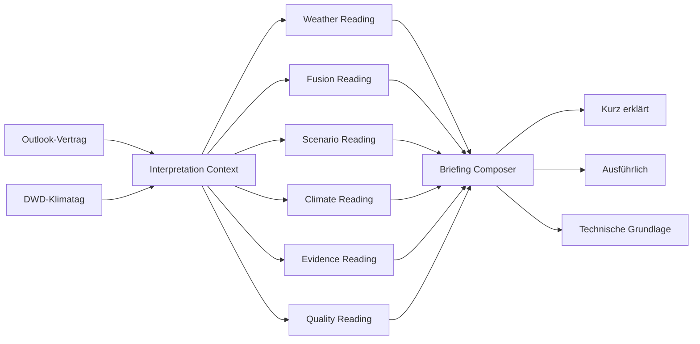

# Forecast Interpretation Engine

Die Forecast Interpretation Engine übersetzt die bereits berechneten ISOBAR-Daten in nachvollziehbare Alltagssprache. Sie erzeugt **keine zusätzliche Wetterprognose**, verändert keine Rohdaten und verwendet kein Sprachmodell. Jede Aussage entsteht deterministisch aus versionierten Regeln und verweist auf die verwendeten Felder.

## Ziele

- Wetterdaten für Menschen ohne meteorologische Fachsprache erklären;
- Wetterlage, Modellstreuung, Szenarien, Klima, Evidenz und Datenqualität gemeinsam lesen;
- fehlende Daten sichtbar lassen, statt sie mit scheinbar sicheren Aussagen zu ersetzen;
- jede technische Aussage bis zu einem Datenfeld zurückverfolgbar machen;
- Texte bei identischer Eingabe reproduzierbar erzeugen;
- neue Fachbereiche ergänzen, ohne eine monolithische Textfunktion zu vergrößern.

## Nicht-Ziele

- keine neue Modellfusion;
- keine KI-generierte Zusammenfassung;
- keine automatische Vorhersagekorrektur;
- keine Umdeutung roher Ensembleanteile zu kalibrierten Wahrscheinlichkeiten;
- keine medizinische, sicherheitsrelevante oder amtliche Unwetterberatung.

## Datenfluss



Der Collector und die vorhandenen Adapter bleiben für Berechnung und Beschaffung verantwortlich. Die Interpretation beginnt erst, wenn ein `Outlook` vorliegt.

## Codeaufteilung

```text
frontend/src/lib/
├─ forecast-interpretation.ts       stabile öffentliche Fassade
└─ interpretation/
   ├─ index.ts                      öffentliche Exporte
   ├─ types.ts                      Verträge für Kontext, Insights und Briefing
   ├─ context.ts                    Normalisierung auf einen Gültigkeitstag
   ├─ helpers.ts                    reine Format- und Statistikhelfer
   ├─ thresholds.ts                 benannte sprachliche Schwellenwerte
   ├─ composer.ts                   Modulreihenfolge, Status und Gesamtbriefing
   ├─ interpretation.test.ts        Regel- und Grenzfalltests
   └─ modules/
      ├─ weather.ts                 Wetterlage und Empfinden
      ├─ fusion.ts                  Modelle, Fusion und Streuung
      ├─ scenario.ts                Szenarien und Laufentwicklung
      ├─ climate.ts                 historischer Kalendertagsvergleich
      ├─ evidence.ts                Verifikation und Challenger
      └─ quality.ts                 Datenqualität und Herkunft
```

UI-Komponenten importieren nur die Fassade `forecast-interpretation.ts`. Die interne Ordnerstruktur kann dadurch später verändert werden, ohne sämtliche Komponenten anzupassen.

## Verträge

### `InterpretationContext`

`buildInterpretationContext(outlook, date, climate)` normalisiert alle Informationen für genau einen Gültigkeitstag:

- Index und Horizont-Bucket;
- dynamisch verfügbare Einzellaufmodelle;
- Fusion und vorheriger Fusionstag;
- Unsicherheitszerlegung und passendes Szenariofenster;
- Multi-run Memory, direkter Vorgängerlauf und Fragility;
- Evidence Shadow, MOSMIX und Kalibrierungs-Challenger;
- optionaler DWD-Klimatag.

Ein Modul sucht diese Daten nicht erneut zusammen. Dadurch verwenden alle Module dieselbe Tagesdefinition.

### `InterpretationInsight`

Ein einzelnes Insight enthält:

| Feld | Bedeutung |
| --- | --- |
| `id` | stabile Kennung für Tests und UI |
| `domain` | fachlicher Bereich |
| `priority` | vorgesehene fachliche Gewichtung |
| `tone` | neutrale, positive oder vorsichtige Darstellung |
| `title` | kurze Kernaussage |
| `simple` | optionale Alltagssprache für den primären Überblick |
| `plain` | allgemein verständliche Erklärung |
| `technical` | technische Herleitung |
| `evidence` | Wert, Bezeichnung und Quellpfad |
| `limitation` | explizite Grenze der Aussage |

### `InterpretationSection`

Ein Modul liefert immer eine Section. Fehlen Daten, verschwindet der Bereich nicht, sondern erhält einen Abdeckungsstatus:

- `available`: die wesentlichen Eingaben sind vorhanden;
- `partial`: Teilinformationen sind vorhanden;
- `unavailable`: für den gewählten Tag fehlt die fachliche Grundlage.

### `ForecastBriefing`

Der Composer erzeugt das UI-fertige Ergebnis mit Datum, Gesamtstatus, Headline, sechs Sections, Abdeckungsübersicht, Einzellaufmatrix, Methodenversion und einer gemeinsamen Aussagegrenze.

## Fachmodule

| Modul | Haupteingaben | Erklärt | Behauptet ausdrücklich nicht |
| --- | --- | --- | --- |
| Weather | Fusion oder Einzelläufe, Gefühlstemperatur, Feuchte, Taupunkt, Wind | Temperaturmitte, Tagestrend, Regensignal, mögliches Empfinden | Median als Garantie; rohen Regenanteil als automatisch kalibrierte Wahrscheinlichkeit |
| Fusion | Modellspanne, P10–P90, Varianzzerlegung, Modell-/Memberzahl | absolute Streuung und Herkunft der Streuung | Modellnähe als Trefferquote |
| Scenario | Pfadcluster, Branching, Run Memory, Run Stability, Fragility | mögliche zusammenhängende Entwicklungen und Änderungsanfälligkeit | Szenarioanteile oder Fragility als Fehlerwahrscheinlichkeit |
| Climate | DWD-Kalendertag, Normalperiode, Stationshistorie | Abweichung zur historischen Mitte und historisches Perzentil | einzelnen Tag als Klimatrend; historische Häufigkeit als Tagesprognose |
| Evidence | Kalibrierung, Out-of-Sample-Gate, Referenzstation, MOSMIX, Challenger, Diagnostik | was bereits gegen Beobachtungen geprüft wurde | Shadow-Ergebnis als Live-Prognose; automatische Promotion |
| Quality | Data Quality, Quelle, Aktualisierungszeit, Forecast Passport, RADOLAN, Warnungen | Vollständigkeit, Herkunft und Reproduzierbarkeit | technische Vollständigkeit als Prognosegüte |

Jedes Modul besitzt eine eigene Methodenversion. Die Gesamtkomposition trägt zusätzlich `forecast-interpretation-v2.0.0`.

## Sprachliche Schwellenwerte

Die Werte in `thresholds.ts` steuern nur die **Wortwahl**. Sie sind transparent benannte Produktheuristiken und keine statistisch kalibrierten Fehlerwahrscheinlichkeiten.

| Bereich | Schwelle | Aktuelle Bedeutung |
| --- | ---: | --- |
| Einzellauf-Modellspanne | unter 2 K | Modelle liegen eng zusammen |
| Einzellauf-Modellspanne | ab 4 K | deutlich unterschiedliche Entwicklungen |
| absolute Ensemble-Streuung | unter 0,8 K Standardabweichung | kompakte Verteilung |
| absolute Ensemble-Streuung | ab 1,8 K Standardabweichung | deutlich breite Verteilung |
| P10–P90-Modellkorridor | unter 3 K | eher enge Spanne in der Übersicht |
| P10–P90-Modellkorridor | ab 7 K | nur grobe Orientierung möglich |
| Gefühl vs. Lufttemperatur | ab 2 K Unterschied | wahrnehmbarer zusätzlicher Komforteffekt |
| relative Feuchte | unter 45 % | eher trocken, sofern auch der Taupunkt niedrig ist |
| relative Feuchte | über 65 % | feuchteres Profil |
| Taupunkt | unter 14 °C | trockenerer Kontext |
| Taupunkt | ab 18 °C | feuchter bis möglicherweise schwüler Kontext |
| rohes Regensignal ≥ 1 mm | bis 20 % | niedrig |
| rohes Regensignal ≥ 1 mm | ab 40 % | geteilt bis erhöht |
| rohes Regensignal ≥ 1 mm | ab 70 % | starkes Rohsignal |
| Scenario Branching | ab 30/100 | unterscheidbare Pfade |
| Scenario Branching | ab 60/100 | klar getrennte Pfade |
| Tagestrend | ab 0,8 K | sichtbare Veränderung zum Vortag |
| Klimaabweichung | ab 1 K | bemerkbare Abweichung |
| Klimaabweichung | ab 3 K | deutliche Abweichung |

Eine Änderung dieser Werte muss als fachliche Textänderung reviewed und durch Tests abgesichert werden. Sie darf nicht stillschweigend als Genauigkeitsverbesserung beschrieben werden.

## Gesamtstatus

Der Status `robust`, `mixed`, `open` oder `unknown` ist eine **Datenlesart**, keine Trefferquote.

Priorität der Entscheidung:

1. Kritische Datenqualität erzwingt `unknown`.
2. Ist ein Fragility-Wert vorhanden, bestimmt dessen Stufe die Lesart.
3. Im Einzellaufmodus werden Modellspanne und Horizont verwendet.
4. Fehlt im Ensemblemodus die Fragility-Grundlage, bleibt der Status `unknown`.

Damit wird fehlende Evidenz niemals versehentlich als robuste Prognose angezeigt.

## Drei Darstellungsstufen

`ForecastInterpreter.vue` zeigt dasselbe Briefing in drei Sichten:

1. **Überblick**: nur vorhandene, entscheidungsrelevante Aussagen in eigener Alltagssprache;
2. **Mehr Kontext**: vorhandene Insights mit ihrer jeweiligen Aussagegrenze;
3. **Methodik**: Methode, technische Herleitung, Originalwert und Quellpfad.

Es werden nicht drei verschiedene Texte berechnet. Alle Sichten lesen dasselbe strukturierte Ergebnis. Dadurch können Kurzfassung und technische Ansicht nicht fachlich auseinanderlaufen.

Fehlende Zusatzmodule sind im Überblick kein Inhalt: Sie erzeugen weder leere Karten noch großflächige `unavailable`-Meldungen. In „Mehr Kontext“ können sie gesammelt in einem kleinen aufklappbaren Status erscheinen; die Methodik zeigt die vollständige technische Abdeckung.

## Gemeinsamer Gültigkeitstag

`LongRangeLab.vue` besitzt den gemeinsamen `selectedDate`-State. Die folgenden Komponenten verwenden ihn über `v-model:selected-date`:

- Forecast Interpreter;
- Evidence Engine;
- Scenario Engine;
- Climate Time Machine.

Die Climate Time Machine lädt den passenden DWD-Kalendertag und meldet ihn zurück an das Lab. Der Interpreter erhält genau diesen Klimadatensatz. Eine Anzeige, in der beispielsweise Szenarien für Dienstag und Klimawerte für Mittwoch nebeneinander stehen, ist damit ausgeschlossen.

## Fehlende Daten und Fehlerfälle

- Optionale Werte werden als `—` ausgegeben, nicht als `NaN` oder `undefined`.
- Fehlende Fachbereiche bleiben als `unavailable` sichtbar.
- Providerwarnungen werden in der Quality Section zusammengeführt.
- Ein veralteter Lauf wird als solcher benannt.
- Ein fehlender Klimatag blockiert Wetter- und Modellinterpretation nicht.
- Schnell wechselnde Klimatage verwenden eine Sequenzkennung; verspätete Antworten dürfen den aktuell ausgewählten Tag nicht überschreiben.

## Laufzeit und Skalierung

Die Engine arbeitet vollständig im Browser und linear über die für einen Tag verfügbaren Modelle und Insights. Sie führt keine zusätzlichen Wetter-Requests aus. Nur der Klimakalender lädt bei Bedarf den DWD-Kalendertag und verwendet einen lokalen Cache pro Monatstag.

Die fachliche Skalierung erfolgt über Module statt über eine wachsende Fallunterscheidung. Ein neues Modul verändert die bestehenden sechs Module nicht.

## Testinvarianten

`npm run test` prüft aktuell:

- feste Reihenfolge und Abdeckung aller sechs Domains;
- Methodenversionen und Quellnachweise;
- kein robuster Ensemble-Status ohne Fragility-Daten;
- Vorrang kritischer Datenqualität;
- klare Kennzeichnung roher Regen- und Szenarioanteile;
- dynamische statt fest codierter Modellanzahl;
- keine unbeabsichtigten `NaN`-/`undefined`-Texte;
- reproduzierbares Ergebnis bei identischer Eingabe;
- Klimaanomalie mit ausdrücklicher Grenze zum Klimatrend.

## Neues Modul ergänzen

1. Domain und Verträge in `types.ts` erweitern.
2. Benötigte Eingaben einmalig in `context.ts` normalisieren.
3. Sprachschwellen ausschließlich benannt in `thresholds.ts` ergänzen.
4. Ein reines Modul unter `modules/` anlegen.
5. Für jedes Insight Alltagstext, technische Herleitung, Evidence-Pfade und Grenze liefern.
6. Modul in `interpretationModules` registrieren.
7. Abdeckungs- und Grenzfalltests ergänzen.
8. Fachmodultabelle und Schwellenwerte in diesem Dokument aktualisieren.
9. Erst danach die UI um eine besondere Visualisierung erweitern, falls die bestehende generische Darstellung nicht genügt.

## Review-Regeln

- Ein Wert wird nur als Wahrscheinlichkeit bezeichnet, wenn sein Vertrag und seine Verifikation dies tragen.
- Eine Korrelation, ein Rohanteil oder ein Index erhält keine kausale Formulierung.
- „Sicher“, „beweist“ oder „wird eintreten“ sind für Modellverteilungen unzulässig.
- Jede neue Aussage benötigt mindestens einen Evidence-Pfad.
- Jede fachliche Ausnahme benötigt eine sichtbare `limitation`.
- Jede Regeländerung erhöht mindestens die betroffene Modulversion; inkompatible Gesamtänderungen erhöhen die Version der Interpretation Engine.
