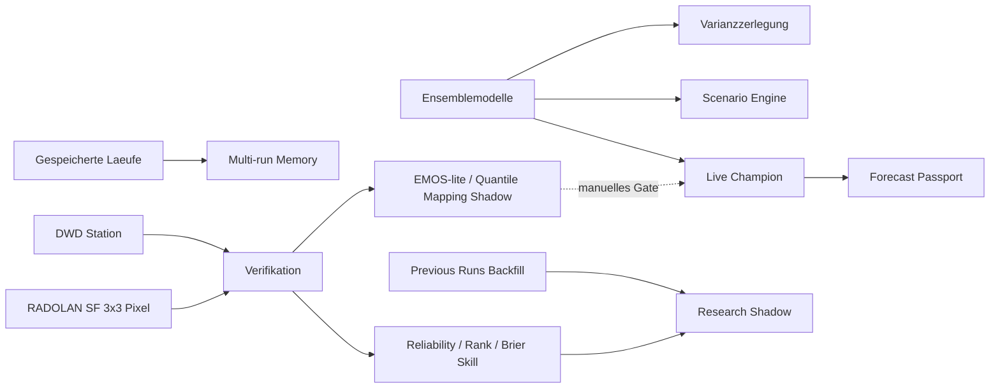

# ISOBAR Research Pipeline v1

Diese Ausbaustufe gewinnt mehr Information aus den bereits vorhandenen Modelllaeufen, ohne den Live-Champion unkontrolliert zu veraendern. Jede Genauigkeitsverbesserung bleibt ein versionierter Shadow-Challenger, bis sie zukuenftige, unabhaengige Daten bestanden hat.

## Datenfluss



## 1. Data Quality und Freshness

`data-quality-v1.0.0` prueft pro Lauf:

- erwartete und vorhandene Fusionsmodelle;
- nutzbare Forecast-Tage und Member;
- vollstaendige Temperatur- und Niederschlagsverteilungen;
- Providerwarnungen sowie das Zeitfenster, ab dem ein publizierter Lauf als alt gilt.

Der Status `degraded` bedeutet eingeschraenkte Evidenz, nicht automatisch eine falsche Prognose.

## 2. Unsicherheitszerlegung

`law-of-total-variance-v1.0.0` zerlegt die Verteilung pro Tag exakt:

```text
Gesamtvarianz = mittlere Varianz innerhalb der Modelle
              + Varianz zwischen den Modellmitteln
```

Damit trennt das Frontend Anfangsbedingungs-/Memberstreuung von strukturellem Modelldissens. Beide Werte sind deskriptiv und keine kalibrierte Fehlerwahrscheinlichkeit.

## 3. Scenario Engine

`model-balanced-trajectory-clustering-v1.0.0` gruppiert komplette Temperatur- und Niederschlagspfade in den Fenstern Tag 1-5, 6-15 und 16-30. Jedes Modell erhaelt unabhaengig von seiner Memberzahl dasselbe Gesamtgewicht. Angezeigt werden:

- modellbalancierter Rohanteil;
- ungewichteter Memberanteil;
- beteiligte Modelle und Member;
- zeitlich kohaerenter Szenariopfad;
- Branching Score als Trennungsindikator der Cluster.

Die Szenarien vermeiden eine aus unabhaengigen Tagesmedianen zusammengesetzte Kurve, die kein einzelner Modellpfad tatsaechlich simuliert hat.

## 4. Multi-run Memory und Forecast Passport

Das Laufgedaechtnis wertet bis zu zwoelf archivierte Laeufe aus. Es misst Konvergenz, Divergenz, mittlere Revision und Richtungswechsel pro Gueltigkeitstag.

Der Forecast Passport friert fuer jeden Lauf ein:

- Payload-Hash und Run-ID;
- Algorithmus- und Methoden-Versionen;
- Modell-IDs und Memberzahlen;
- Data-Quality-Status und Datenquelle.

Alte Prognosen werden nicht nachtraeglich umgeschrieben.

## 5. RADOLAN und Standorte

Fuer abgeschlossene Tage laedt der Collector DWD RADOLAN SF. Der lokale Wert ist ein 3 x 3 Pixel grosses Flaechenmittel im 1-km-Raster. Stationsniederschlag bleibt separat im Referenzdokument erhalten; die aktive Niederschlagsquelle wird explizit markiert.

Zentral gesammelt werden Koeln, Berlin, Hamburg, Muenchen, Frankfurt und Stuttgart. Suchergebnisse in bis zu 35 km Entfernung werden dem passenden zentralen Firestore-Dokument zugeordnet. Andere Orte nutzen weiterhin den direkten Browser-Fallback.

## 6. Historischer Shadow-Backfill

`previous-runs-shadow-backfill-v1.0.0` laedt woechentlich bis zu 90 Tage fuer feste Vorhersageabstaende von eins bis sieben Tagen. Die deterministischen Archive fuer ICON-EU, IFS und GFS liegen getrennt unter:

```text
publicWeather/{locationId}/researchBackfill/{modelId}
publicWeather/{locationId}/researchBackfill/status
```

Der Backfill ist Research/Pretraining. Modellversionswechsel und der deterministische Charakter verhindern, dass er das Live-Out-of-Sample-Gate ersetzt.

## 7. Probabilistische Diagnostik

`probabilistic-diagnostics-v1.0.0` erzeugt nach Lead-Bucket:

- Reliability-Bins fuer Regen >= 1 mm und >= 10 mm;
- Brier Score und Brier Skill gegen die Ereignisrate im Diagnosefenster;
- empirische Temperatur-Ranghistogramme;
- Abdeckung des P10-P90-Intervalls;
- mittleren CRPS fuer Champion und Shadow.

Leere oder kleine Bins bleiben sichtbar und werden nicht als belastbare Kalibrierung verkauft.

## 8. Kalibrierungs-Challenger

`emos-lite-quantile-mapping-shadow-v1.0.0` ist vorbereitet, aber immer `live: false`. Er lernt pro Lead-Bucket eine robuste Median-Biaskorrektur und begrenzte Spread-Skalierung. Ab 30 Tagen darf ein Bucket als `eligible-shadow` gerechnet werden; eine Promotion bleibt trotzdem manuell und benoetigt das getrennte Zukunfts-Gate.

## Deployment und Betrieb

- Der Collector laeuft viermal taeglich in GitHub Actions.
- Historischer Backfill wird hoechstens woechentlich erneuert.
- Unveraenderte Scorefenster werden nicht viermal taeglich neu aggregiert.
- Der Produktionsworkflow testet Collector und Frontend und deployed Hosting, Firestore-Regeln und Indizes.
- Die oeffentliche Firebase-Webkonfiguration wird von `/__/firebase/init.json` geladen; nur der bereits vorhandene Service Account bleibt ein GitHub Secret.

Die wissenschaftliche Grenze bleibt unveraendert: Neue Auswertungen koennen sofort live beschrieben werden. Eine Behauptung hoeherer Prognoseguete braucht weiterhin reale zukuenftige Beobachtungstage.
