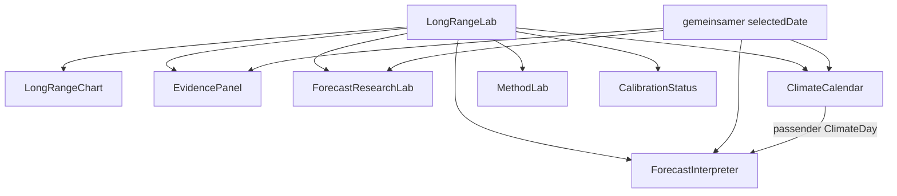

# UI-, Labor- und Graphmodule

Dieses Dokument beschreibt die sichtbaren ISOBAR-Module, ihre Datenquellen, Interaktionen und fachlichen Grenzen. Es ergänzt die [Forecast Interpretation Engine](INTERPRETATION_ENGINE.md), die [Research Pipeline](RESEARCH_PIPELINE.md) und die [Evidence Engine](EVIDENCE_ENGINE.md).

## Komponentenfluss

`LongRangeLab.vue` ist die Composition Root der langfristigen Oberfläche. Es lädt den `Outlook`, verwaltet Reichweite und Metrik, erzeugt die Chartserien und hält den gemeinsamen Gültigkeitstag.

## Modulübersicht

| Komponente | Aufgabe | Haupteingaben | Eigener veränderlicher State |
| --- | --- | --- | --- |
| `LongRangeLab.vue` | Orchestrierung des 16-/30-Tage-Labors | Standort, `Outlook` | View, Chartmetrik, Quellmodelle, gemeinsamer Tag |
| `LongRangeChart.vue` | interaktive Zeitreihen und Unsicherheitsbänder | Datumsliste, `ChartSeries[]`, Einheit | Fokusindex, sichtbare/aktive Reihe |
| `ForecastInterpreter.vue` | verständliches Briefing in drei Tiefen | `Outlook`, gemeinsamer Tag, `ClimateDay` | gewählter Detailgrad |
| `EvidencePanel.vue` | Champion/Shadow/MOSMIX und Verifikations-Gate | Ensemble-Outlook, gemeinsamer Tag | kein abweichender Tagesstate |
| `ForecastResearchLab.vue` | Varianz, Szenarien, Memory, Passport, Diagnostik | Ensemble-Outlook, gemeinsamer Tag | ausgewähltes Szenariofenster |
| `ClimateCalendar.vue` | historischer DWD-Kalendertag | Standort, Ensemble-Outlook, gemeinsamer Tag | gewähltes Archivjahr, Klimatag-Cache |
| `CalibrationStatus.vue` | kompakter Lern- und Aktivstatus | `CalibrationStatus` | keiner |
| `MethodLab.vue` | interaktive Methodenerklärung | `Outlook` | gewähltes Kapitel und Demo-Eingaben |
| `MetricHelp.vue` | kontextuelle Kurzdefinition | Titel, Text, Formel, Grenze | geöffnet/geschlossen |
| `WeatherChart.vue` | 36-Stunden-Modellvergleich | Kurzfristserien | Fokus und Reihe |
| `DailyForecast.vue` | Tageskarten der Kurzfristansicht | tägliche Zusammenfassung | keiner |
| `PaletteControl.vue` | Auswahl der Designpalette | Palette-Composable | Palette und Automatik |

## `LongRangeLab.vue`

### Verantwortung

- lädt große Datenmengen erst nach Wahl von 16 oder 30 Tagen;
- hält getrennte Ergebnisse pro View;
- bricht überholte Requests bei Standortwechsel ab;
- bereitet reine `ChartSeries` für den Chart vor;
- zeigt Fusionsstatus, Horizontabdeckung und Run-to-run-Kennzahlen;
- synchronisiert den ausgewählten Tag zwischen den erklärenden Laboren.

### 16-Tage-Modus

Der Modus zeigt native Einzelläufe. Der hervorgehobene Modellmedian entsteht pro Tag nur aus tatsächlich vorhandenen Modellwerten. Das Band umfasst Minimum bis Maximum dieser Modellwerte. Modelle werden nicht künstlich bis Tag 16 verlängert.

### 30-Tage-Modus

Der Modus zeigt die modellbalancierte Fusion mit P10–P90-Band und optionalem P25–P75-Innenband. Quellmodelle können eingeblendet werden. EC46 bleibt als separate Langfrist-Referenz sichtbar und wird nicht unbemerkt in die Tagesfusion aufgenommen.

### Grenzen

- Ein Chartband ist eine Modellverteilung und ohne nachgewiesene Kalibrierung kein Garantieintervall.
- Eine sinkende Modellzahl im langen Horizont ist erwartbar und wird pro Tag ausgewiesen.
- Die UI berechnet keine neue meteorologische Fusion.

## `LongRangeChart.vue`

### Datenvertrag

Eine `ChartSeries` kann enthalten:

- `values`: Mittellinie oder Einzelkurve;
- `lower` und `upper`: äußeres Band;
- `innerLower` und `innerUpper`: optionales inneres Band;
- `emphasized`: visuelle Hauptreihe;
- `secondary`: zurückhaltende Quellreihe;
- `pointDetails`: Zusatzkontext für den fokussierten Tag.

### Visuelle Semantik

| Element | Bedeutung |
| --- | --- |
| kräftige Linie | aktive Hauptreihe oder Fusion |
| äußeres Band | P10–P90 oder vollständige Modellspanne, abhängig vom Modus |
| inneres Band | P25–P75 der Fusion |
| dünne Sekundärlinie | einzelnes Quellmodell |
| vertikaler Fokus | aktuell per Maus, Touch oder Tastatur untersuchter Tag |

Bandbedeutungen dürfen nicht ohne Änderung von Legende und Dokumentation ausgetauscht werden.

### Interaktion und Barrierearmut

- Pointer und Touch bestimmen den nächstliegenden Tag;
- linke und rechte Pfeiltaste bewegen den Fokus;
- Modellreihen können hervorgehoben werden;
- Werte bleiben zusätzlich als Textreadout verfügbar;
- Fokuszustände müssen sichtbar bleiben.

## `ForecastInterpreter.vue`

Der Interpreter liest das strukturierte `ForecastBriefing`; er enthält selbst keine meteorologischen Schwellenwerte.

### Ansichten

- **Überblick** zeigt nur tatsächlich vorhandene Wetter-, Spielraum-, Entwicklungs- und Klimaaussagen in Alltagssprache.
- **Mehr Kontext** zeigt vorhandene regelbasierte Insights und Grenzen; leere Fachbereiche werden nicht als Inhaltskarten gerendert.
- **Methodik** zeigt Module, Versionen, Originalwerte, Datenpfade und die technische Abdeckung.

Eine Änderung des Detailgrads löst keine Neuberechnung oder Netzwerkanfrage aus.

### Abdeckung

Die Abdeckungsmatrix lebt ausschließlich in der Methodikansicht. Fehlende Klimadaten dürfen weder wie ein neutraler historischer Vergleich wirken noch den primären Überblick mit einer Leerkarte füllen.

## `EvidencePanel.vue`

Das Evidence Lab hält drei Rollen bewusst auseinander:

1. **Live Champion**: bestimmt die sichtbare Fusion;
2. **Evidence Shadow**: archiviert eine alternative, bias-/spread-korrigierte Verteilung ohne Live-Eingriff;
3. **DWD MOSMIX**: externe stationsoptimierte Vergleichsprognose.

Zusätzlich zeigt es:

- Fragility Index und seine Treiber;
- Out-of-Sample-Gate;
- CRPS, Brier Score, Bias, Diversity Penalty und Gewichte pro Horizont;
- Referenzstation oder markierten Fallback.

Ein positives Gate bedeutet nur „manuelle Promotion prüfbar“. Es schaltet den Shadow nie automatisch live.

## `ForecastResearchLab.vue`

### Varianzzerlegung

Die Temperaturvarianz wird nach dem Gesetz der totalen Varianz in zwei Quellen zerlegt:

- innerhalb der Modelle: Streuung der Ensemblemitglieder;
- zwischen den Modellen: Unterschiede der Modellmittel.

Die Prozentanteile beschreiben die Herkunft der vorhandenen Varianz. Sie sind weder Fehlerquote noch Eintrittswahrscheinlichkeit. Für die praktische Breite ist zusätzlich die absolute Gesamtstreuung relevant; diese erklärt der Forecast Interpreter.

### Scenario Engine

Vollständige Temperatur-/Niederschlagspfade werden in zusammenhängende Szenarien gruppiert. Angezeigt werden modellbalancierter Rohanteil, beteiligte Modelle und Member sowie der Branching Score.

Der Rohanteil eines Clusters ist keine kalibrierte Szenariowahrscheinlichkeit.

### Laufgedächtnis

Das Multi-run Memory betrachtet mehrere archivierte Läufe desselben Gültigkeitstags. `converging`, `stable` und `diverging` beschreiben die Entwicklung der Revisionen, nicht die spätere Richtigkeit.

### Probabilistische Diagnostik

CRPS, Intervallabdeckung, Brier Scores und Reliability-Bins erscheinen getrennt nach Horizont-Bucket. Leere oder kleine Stichproben bleiben sichtbar unvollständig.

## `ClimateCalendar.vue`

Die Climate Time Machine lädt für den Monatstag des ausgewählten Prognosetags einen zentral erzeugten DWD-Datensatz.

Sie zeigt:

- Normalperiode 1991–2020 mit P10/P50/P90;
- Abweichung der aktuellen Fusion von der historischen Mitte;
- historisches Perzentil;
- verfügbare Stationsrekorde;
- einzelne Archivjahre über einen Slider;
- historische Regenhäufigkeiten.

### Request- und Cacheverhalten

- `climateToday` aus dem Outlook wird direkt verwendet, wenn der Monatstag passt;
- weitere Monatstage werden pro Komponentensitzung gecacht;
- bei Standort- oder Laufwechsel wird der Cache geleert;
- eine Sequenzkennung verwirft verspätete Antworten nach schnellem Tageswechsel;
- Loading-, Fehler- und Leerzustand sind getrennt.

### Grenzen

- Eine Stationsreihe ist punktuell.
- Ein Tagesperzentil beschreibt keinen langfristigen Trend.
- Historische Regenhäufigkeit ist keine Prognosewahrscheinlichkeit.

## `CalibrationStatus.vue`

Die Karte trennt die neutrale Sammelphase vom aktiven, konservativ gewichteten Zustand. Angezeigt werden unabhängige Tage, bewertete Prognosen, Mindestmenge und aktive Horizont-Buckets. Sie ist eine Statusanzeige, keine Güteauszeichnung.

## `MethodLab.vue`

Das Method Lab ist ein interaktiver Lernbereich. Es erklärt Datenherkunft, Quantile, Modellbalancierung, Verifikation und Grenzen anhand kontrollierter Beispiele. Demo-Regler verändern keine Live-Prognose und dürfen nicht mit Collector-Ergebnissen vermischt werden.

## `MetricHelp.vue`

Metric Help bleibt für punktuelle Definitionen sinnvoll. Es ist jedoch nicht die primäre Erklärungsebene. Der Forecast Interpreter trägt die zusammenhängende Lesart; Tooltips beantworten nur lokale Rückfragen zu einer Kennzahl.

## Zustandsregeln

1. Der Standort gehört der übergeordneten Anwendung.
2. Der Outlook-View gehört `LongRangeLab`.
3. Der Gültigkeitstag gehört einmalig `LongRangeLab` und wird weitergereicht.
4. Ein untergeordnetes Modul darf nur fachlich lokalen UI-State besitzen, etwa Detailgrad, Szenariofenster oder Archivjahr.
5. Netzwerkergebnisse müssen dem Standort und dem gewählten Tag zugeordnet bleiben.
6. Ein Refresh darf eine gültige Tagesauswahl erhalten; nur nicht mehr vorhandene Tage werden auf einen sinnvollen Standard zurückgesetzt.

## Neues Graphmodul ergänzen

Vor der Implementierung beantworten:

1. Welche fachliche Frage wird visuell schneller verständlich als in Textform?
2. Welche Originalfelder bilden die Eingabe?
3. Welche Transformationen werden vorgenommen?
4. Ist die Skala absolut, relativ, normiert oder probabilistisch?
5. Welche Werte fehlen möglicherweise?
6. Welche Fehlinterpretation muss direkt am Graph ausgeschlossen werden?
7. Wie ist die Information ohne Maus und auf einem kleinen Bildschirm erreichbar?

Danach:

- einen schmalen TypeScript-Datenvertrag definieren;
- Berechnung von SVG-/DOM-Darstellung trennen;
- Legende und Einheiten direkt mit dem visuellen Encoding dokumentieren;
- Null-, Ein-Punkt-, lange Horizont- und Extremwertfälle testen;
- dieses Dokument und die fachlich zuständige Methodendokumentation aktualisieren.

## Performance-Leitlinien

- große Outlook-Daten erst nach Benutzerwahl laden;
- abgeleitete Reihen als `computed` erzeugen;
- keine Wetter-Requests aus Präsentationskomponenten;
- Animationen auf Transform/Opacity begrenzen und `prefers-reduced-motion` respektieren;
- zusätzliche Canvas- oder Chart-Bibliotheken nur einsetzen, wenn native SVG/HTML die fachliche Darstellung nicht sinnvoll leisten können;
- Erläuterungstexte strukturiert berechnen und nicht mehrfach pro Renderpfad parsen.
