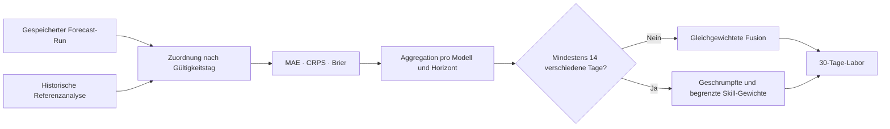

# Forecast-Verifikation und Skill-Gewichte

Diese Stufe macht aus gespeicherten Prognosen eine überprüfbare Zeitreihe. Sie behauptet nicht, dass ISOBAR bereits besser als seine Quellmodelle ist. Sie schafft die Daten, mit denen diese Aussage später getestet werden kann.

## Ablauf



GitHub Actions führt diesen Ablauf alle sechs Stunden aus. Die Verarbeitung ist idempotent: Für die Kombination aus Forecast-Run und Gültigkeitstag entsteht höchstens ein Score-Dokument.

## Referenzdaten

Die erste Referenzquelle sind tägliche DWD-CDC-Stationsmessungen. Für Köln ist Station `02667` Köln/Bonn explizit konfiguriert. Messqualität, Stationsentfernung und der Status `final` oder `provisional` bleiben erhalten.

Fehlt ein Messtag, nutzt ISOBAR die Open-Meteo Historical Forecast API mit `Best Match` als ausdrücklich markierten `analysis-proxy`:

- Der Proxy liegt näher an den analysierten Wetterbedingungen als eine alte Vorhersage.
- Er ist global und im gleichen Tagesformat verfügbar.
- Er ist keine lokale Stationsmessung und kein perfekter Ground Truth.
- Ein Fallback-Dokument wird nie als DWD-Messung ausgegeben.

## Metriken

Für jeden Modell-Run und Gültigkeitstag werden gespeichert:

- Temperatur-MAE des Ensemblemedians;
- Temperatur-CRPS der vollständigen Ensembleverteilung;
- Niederschlags-MAE des Ensemblemedians;
- Brier Score für die Ereignisse `>= 1 mm` und `>= 10 mm`;
- Memberzahl, Ausgabezeitpunkt und Vorhersagehorizont.

Die Ergebnisse werden getrennt aggregiert für:

- Tag 0–3;
- Tag 4–7;
- Tag 8–15;
- Tag 16–30.

Ein Modell wird dadurch nicht für einen naturgemäß schwierigeren 15-Tage-Horizont mit seinen eigenen Kurzfristwerten vermischt.

## Aktivierungsregel

Skill-Gewichte werden erst ab 14 **verschiedenen Gültigkeitstagen** pro Modell und Horizont aktiviert. Vier Modellläufe desselben Tages zählen dabei nicht als vier unabhängige Tage.

Aktive Gewichte sind:

- nach Temperatur und Niederschlag getrennt;
- relativ zum Medianverlust der vergleichbaren Modelle berechnet;
- mit einer 30-Tage-Prior zur Gleichgewichtung hin geschrumpft;
- auf den Bereich `0,5` bis `2,0` begrenzt.

Fehlen genügend Daten, bleibt das neutrale Gewicht `1,0` aktiv. Die Wahrscheinlichkeiten bleiben auch mit Skill-Gewichten empirische Ensembleanteile; Gewichtung ist noch keine vollständige probabilistische Kalibrierung.

## Firestore-Struktur

```text
publicWeather/{locationId}
  latestOutlook.calibration

publicWeather/{locationId}/references/{yyyy-mm-dd}
  analysis proxy and source metadata

publicWeather/{locationId}/verification/{runId}_{yyyymmdd}
  lead bucket, reference and per-model scores

publicWeather/{locationId}/calibration/current
  rolling metrics and bounded weights
```

Die Aggregation verwendet ein rollierendes Fenster von maximal 3.000 Score-Dokumenten. Das hält Firestore-Reads im kostenlosen Betrieb begrenzt und verhindert, dass sehr alte Modellversionen unbegrenzt dominieren.

## Evidence-Status

Umgesetzt sind DWD-Stationsreferenz, MOSMIX-Challenger, Bias- und Abhängigkeitsparameter im Shadow-Modus, ein transparenter Fragility Index und ein gepaartes Out-of-Sample-Gate. Das Gate verlangt mindestens 30 unabhängige Tage und eine positive untere 95-%-Grenze der CRPS-Verbesserung.

Offen bleiben:

- saisonale und wetterlagenabhängige Auswertung;
- Reliability-Diagramme für Regenwahrscheinlichkeiten;
- vollständige probabilistische Regenkalibrierung;
- Drift-Erkennung, wenn Provider ihre Modelle ändern;
- RADOLAN als zusätzliche flächige Niederschlagsreferenz.

Komplexität allein ist kein Qualitätsbeweis. Eine neue Gewichtung darf nur nach einem getrennten Zukunftstest und explizitem Review die gleichgewichtete Baseline ersetzen.
